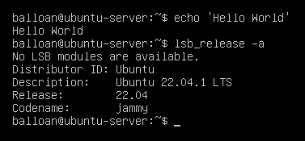
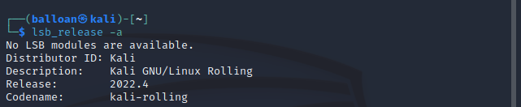
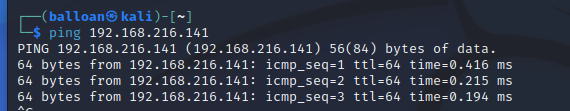

# Overview

The plan for this project is to install, configure and secure a Ubuntu 22.04 LTS server in a virtualized environment.  I'll securely configure common services such as SSH, FTP, SMB and more.

I'll then perform common attacks against these services with another machine on my network in order to validate security controls and configuration. In addition, I'll analyze the associated log files (and potentially packet captures as well).

* * * 

Let's get started!

First, I configured the two machines that I'll be using for this project in VMWare - the Ubuntu server, and a Kali VM to perform the attacks. Both machines are fully up to date (as of the time of this writing)

Let's confirm that the machines are able to communicate with each other.

The environment seems to be working properly and the machines are able to communicate. 

My next steps will be to configure, secure, and potentially attack SSH!
