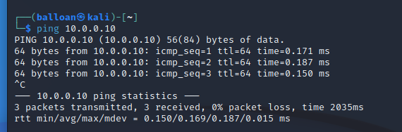

# Environment Setup
First, I configured the two machines that I'll be using for this project in VMWare - the Ubuntu server, and a Kali VM to perform the attacks. Both machines are fully up to date (as of the time of this writing)

Let's confirm that the machines are able to communicate with each other.
I configured the Ubuntu server with a static IP of 10.0.0.10/24. The Kali VM and Ubuntu server are connected to the same subnet.

The environment seems to be working properly and the machines are able to communicate. 

For the purposes of this project, I’m going to create a new user “victim” on the Ubuntu server, which I’ll use in several of the exercises.

My next steps will be to configure, secure, and potentially attack SSH!
