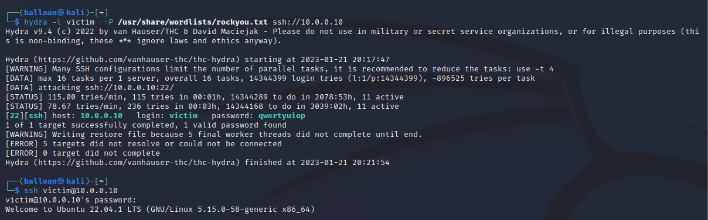
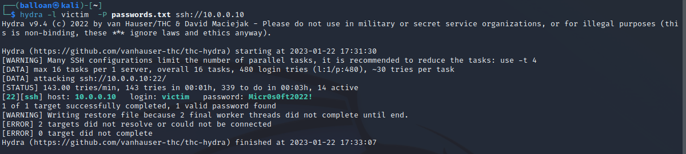
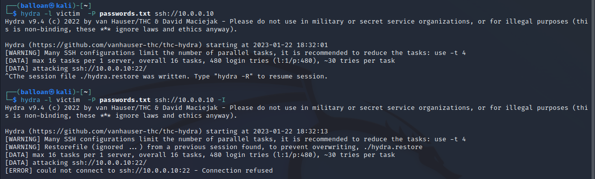
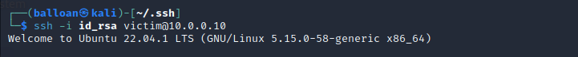
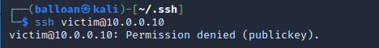
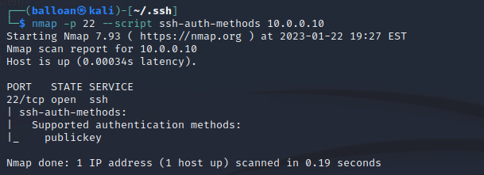
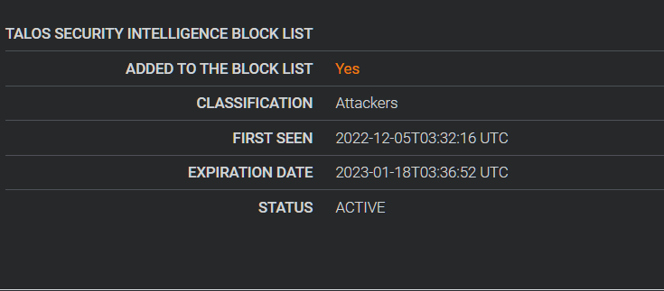

# Attacking and Hardening SSH

I’ll start by attacking the default configuration of this server by performing a dictionary attack against the password of the user `victim` on the Ubuntu server by using the tool Hydra.

Afterwards, I’ll begin hardening the SSH service by looking at solutions such as Fail2Ban, only allowing authentication with keys, and enabling multi-factor authentication. I’ll also look at potentially dangerous SSH settings.

Example bruteforce of a user with a weak password



Obviously, the above example is using an extremely weak password. Just for fun, let’s generate a quick mutated password list based on the word “Microsoft” (pretend that Victim worked there for this example). I used a couple of default word lists, and one custom one I had saved. I quickly generated 480 unique passwords that are various permutations of Microsoft. 

```bash
hashcat password.txt -r /usr/share/hashcat/rules/best64.rule --stdout | sort -u > mutatedlist1.txt
hashcat password.txt -r /usr/share/hashcat/rules/Incisive-leetspeak.rule --stdout | sort -u > mutatedlist2.txt 
hashcat password.txt -r new.rule --stdout | sort -u > mutatedlist3.txt

cat mutatedlist1.txt mutatedlist2.txt mutatedlist3.txt | sort -u > passwords.txt
wc -l passwords.txt   
480 passwords.txt
```



The password `Micr0s0ft2022!` is 14 characters long, with a mix of uppercase, lowercase, symbols and numbers. Most password guidelines would consider that to be a very strong password, but the existence of a dictionary word makes it weak. People tend to be lazy about their passwords; permutations of their company name plus easy to remember symbols and numbers aren’t exactly rare.

It's important to note that there are *many* tools out there to generate password lists. You can use hashcat, as I did here, tools such as CUPP (Common User Passwords Profiler), Mentalist and more. It's extremely easy to make long lists that add various levels of complexity to a password, appending common numbers to the end, etc. Truly random passwords are very difficult to guess. Passwords that are based upon words that can be linked to an individual (company name, spouse name, pet name, sports teams, anything posted about frequently on social media) are significantly more vulnerable, even if it's a seemingly strong password.

* * *
## Hardening SSH

The above attack only works if I'm allowed to attempt to authenticate as many times as I like - let's fix that.

`Fail2Ban` is a program that scans log files such as `/var/log/auth.log` and blocks IP addresses who have too many failed authentications (ie bruteforce attacks). It’s a good way to harden services and discourage bruteforce attacks, while not sacrificing convenience. The default ban time is only 10 minutes, you can adjust the timeout to a value that is appropriate.

The default installation will enable fail2ban for our SSH service. I’m not going to do any in-depth configuration here; it’s more just to show that this exists, and is a good option to help harden the server.

```bash
sudo apt install fail2ban -y

sudo systemctl status fail2ban
fail2ban.service - Fail2Ban Service
    Loaded: loaded (/lib/systemd/system/fail2ban.service; disabled; vendor preset: enabled)
    Active: inactive (dead)
```

I’ll be looking at the configuration file `/etc/fail2ban/jail.conf`, as this file has configuration options such as the services to defend, ban duration, etc.

I’ll make a copy of it named `jail.local`. You aren’t supposed to edit the existing `jail.conf`, as it could get wiped during package updates.

I’ll change the bantime to 1 minute, as I’m going to lock myself out by attempting to bruteforce the SSH service again.

```bash
sudo cp /etc/fail2ban/jail.conf /etc/fail2ban/jail.local

sudo vim /etc/fail2ban/jail.local
# "bantime" is the number of seconds that a host is banned.
bantime  = 1m
```

Starting the fail2ban service: `sudo systemctl start fail2ban`

Let’s confirm it’s working, and is protecting our SSH server. By default, it should time out an IP address after 5 incorrect login attempts.



As you can see, it successfully blocked my connection after a few failed login attempts. This alone would make bruteforcing the service substantially more time consuming, and a much less appealing target.

* * *

## Configuring SSH - Public Key Authentication

Password based authentication is less secure than using keys. It’s possible to guess a password - guessing a key isn’t really viable. In addition,  if we want we can encrypt the private key with a passphrase so it’s required every time we authenticate with the key - this adds another layer of security.

It’s relatively simple to configure public key authentication.

First, we generate a public and private key pair.  Next, we will need to add the public key to the `/home/<user>/.ssh/authorized_hosts` file on the server (creating the directory and file if it doesn’t exist), and keep our private key secure on our client.

That’s it; we’ll be able to authenticate via public keys afterwards.

Note: This example will overwrite the existing contents of the `authorized_keys` file. Append the public key to the end of the existing file to avoid erasing existing allowed keys.

```bash
ssh-keygen -b 4096   
scp id_rsa.pub balloan@10.0.0.10:/home/victim/.ssh/authorized_keys
```



We’re now able to SSH into the server using our private key `id_rsa` instead of a password. It’s important to note that password authentication is still enabled - let’s disable it and only allow authentication to the server via public keys. 

We might as well disable allowing EmptyPasswords to authenticate here as well - it won’t affect public key authentication, but if we had a user account with an empty password for some reason, this blocks it.

```bash
sudo vim /etc/ssh/sshd_config

# To disable tunneled clear text passwords, change to no here!
PasswordAuthentication no  
PermitEmptyPasswords no
```

Next, we need to restart the SSH service, and we should be good to go: `sudo systemctl restart sshd`

Let’s verify that the server will no longer allow me to connect with a password. I temporarily moved my `id_rsa` on my Kali machine so it wouldn’t default to using my private key to authenticate.





* * * 

## Additional Security Considerations

The SSH service is now significantly more secure. As long as we keep our private key safe, nobody should be able to access the server. I recommend putting a password on the private key as well - I didn’t here, as the Ubuntu server is not exposed to the internet. Keep in mind that the same password considerations will apply to the private key; if somebody has access to it they’ll be able to attempt to crack the password offline - a very weak password can be cracked in seconds.

It’s also possible to set up multi-factor authentication for SSH by using something like Google Authenticator and a smartphone to generate a time-based, random code. This would make the server have another layer of defense, and be much harder to compromise. I’m not going to configure it here, but there are plenty of guides out there.

Another possibility is to change SSH from its default port of 22. This would be security through obscurity - not a very good method, and doesn’t really do anything to stop a targeted attack, but I figured I’d mention it. 

Finally, we could only allow access to SSH for certain users by adding a line to the SSH config file - this could be useful depending on the server and its use case.

* * *

## Detecting SSH Attacks

By default, we can see attempts to authenticate to SSH in `/var/log/auth.log`. This makes it very easy to spot dictionary attacks, password spraying and other forms of password attacks.

```
Jan 22 00:23:59 ubuntu-server sshd[1199]: Failed password for victim from 10.0.0.130 port 32798 ssh2
Jan 22 00:23:59 ubuntu-server sshd[1202]: Failed password for victim from 10.0.0.130 port 32832 ssh2
Jan 22 00:23:59 ubuntu-server sshd[1208]: Failed password for victim from 10.0.0.130 port 32898 ssh2
Jan 22 00:23:59 ubuntu-server sshd[1203]: Failed password for victim from 10.0.0.130 port 32840 ssh2
Jan 22 00:23:59 ubuntu-server sshd[1212]: Failed password for victim from 10.0.0.130 port 32930 ssh2
Jan 22 00:24:00 ubuntu-server sshd[1211]: Failed password for victim from 10.0.0.130 port 32916 ssh2
Jan 22 00:24:00 ubuntu-server sshd[1200]: Failed password for victim from 10.0.0.130 port 32810 ssh2
Jan 22 00:24:00 ubuntu-server sshd[1201]: Failed password for victim from 10.0.0.130 port 32822 ssh2
Jan 22 00:24:00 ubuntu-server sshd[1205]: Failed password for victim from 10.0.0.130 port 32860 ssh2
Jan 22 00:24:00 ubuntu-server sshd[1214]: Failed password for victim from 10.0.0.130 port 32950 ssh2
Jan 22 00:24:00 ubuntu-server sshd[1207]: Failed password for victim from 10.0.0.130 port 32888 ssh2
Jan 22 00:24:00 ubuntu-server sshd[1209]: Failed password for victim from 10.0.0.130 port 32902 ssh2
Jan 22 00:24:00 ubuntu-server sshd[1204]: Failed password for victim from 10.0.0.130 port 32850 ssh2
Jan 22 00:24:00 ubuntu-server sshd[1210]: Failed password for victim from 10.0.0.130 port 32906 ssh2
Jan 22 00:24:00 ubuntu-server sshd[1206]: Failed password for victim from 10.0.0.130 port 32872 ssh2
Jan 22 00:24:00 ubuntu-server sshd[1213]: Failed password for victim from 10.0.0.130 port 32934 ssh2
Jan 22 00:24:01 ubuntu-server sshd[1199]: error: maximum authentication attempts exceeded for victim from 10.0.0.130 port 32798 ssh2 [preauth]
```

And so on, for many pages - it’s pretty easy to see the brute force attempts in the log.

We can also check the fail2ban log at `/var/log/fail2ban.log`

```
[2076]: INFO    [sshd] Found 10.0.0.130 - 2023-01-22 23:26:07

2023-01-22 23:26:07,444 fail2ban.filter         [2076]: INFO    [sshd] Found 10.0.0.130 - 2023-01-22 23:26:07
2023-01-22 23:26:07,444 fail2ban.filter         [2076]: INFO    [sshd] Found 10.0.0.130 - 2023-01-22 23:26:07
2023-01-22 23:26:07,444 fail2ban.filter         [2076]: INFO    [sshd] Found 10.0.0.130 - 2023-01-22 23:26:07
2023-01-22 23:26:07,444 fail2ban.filter         [2076]: INFO    [sshd] Found 10.0.0.130 - 2023-01-22 23:26:07
2023-01-22 23:26:07,444 fail2ban.filter         [2076]: INFO    [sshd] Found 10.0.0.130 - 2023-01-22 23:26:07
2023-01-22 23:26:07,674 fail2ban.actions        [2076]: NOTICE  [sshd] Ban 10.0.0.130

.......................

2023-01-22 23:27:08,269 fail2ban.actions        [2076]: NOTICE  [sshd] Unban 10.0.0.130
```

* * *

## Practical Example - Cloud Server

Just for fun, I deployed a Ubuntu server on Google Cloud to monitor SSH activity. It’s interesting seeing all of the attempts that take place on any server that’s exposed to the internet.

Almost immediately, my log files showed attempts to connect to my server via SSH. This shows how important it is to have secure passwords at the very least, but ideally only allow key-based authentication. There are *tons* of machines constantly scanning the internet for vulnerable servers - don’t be one of them.

```
less /var/log/auth.log

Jan 15 21:33:26 instance-1 sshd[8451]: Invalid user vagrant from <SNIP> port 50664
Jan 15 21:33:26 instance-1 sshd[8453]: Invalid user telnet from <SNIP> port 61791
Jan 15 21:33:26 instance-1 sshd[8453]: Connection reset by invalid user telnet <SNIP> port 61791 [preauth]
Jan 15 21:33:27 instance-1 sshd[8451]: Connection reset by invalid user vagrant <SNIP> port 50664 [preauth]
Jan 15 21:34:15 instance-1 sshd[8465]: Received disconnect from <SNIP> port 43840:11: Bye Bye [preauth]
Jan 15 21:34:15 instance-1 sshd[8465]: Disconnected from authenticating user root <SNIP> port 43840 [preauth]
Jan 15 21:40:32 instance-1 sshd[8516]: Received disconnect from <SNIP> port 38932:11: Bye Bye [preauth]
Jan 15 21:40:32 instance-1 sshd[8516]: Disconnected from authenticating user root <SNIP> port 38932 [preauth]
...
<SNIP>
```

I did a lookup of one of the IP addresses in question through Cisco’s Talos Intelligence reputation center. The IP is from South Korea, it’s listed as untrusted, and it’s currently on the Talos Security Intelligence Block List - understandably!

I also searched the IP addresses on VirusTotal, and they were flagged as malicious. One of them had a community member comment that one of the IP addresses in question was conducting SSH bruteforcing attacks.



I was curious about all of the usernames that were regularly targeted, so I figured I’d leave the server running for a week and see. The majority of the authentication attempts were for “root”, so I exclusively filtered for invalid usernames on my server.

```
grep 'sshd.*Invalid user' /var/log/auth.log | cut -d ' ' -f 8 | sort -u > usernames.txt

wc -l usernames.txt 
492 usernames.txt

sed ':a;N;$!ba;s/\n/,/g' usernames.txt | cat

Admin,CISINFO,ONTUSER,aaron,adam,adi,aditya,adm,admin,admin1,admin2,adminweb,adsl,alan,alarm,albert123,alberto,alcatel,alexandre,alfresco,ali,allan,alpha,alumno,amir,amit,ana,andrew,andy,angel,angelica,anil,anjana,ansibleuser,anto,antoine,antonio,apacher,api,appldev,applprod,arkserver,asap,asc,auto,avi,backend,bdos,benjamin,bhx,bigdata,bigipuser3,billy,blog,bluesky,bml,bni,bob,boss,bot,bot2,bpuser,brian,brother,build,bwadmin,cam,camera,camtest,carlos,cas,cashier,cc,centos,cgpexpert,chengfang,chenyd,cipensiamonoicasa,cloud,common,compras,confluence,consulta,control,copia,copias,core,cpd,cqj,cs,csgosrv,cvsuser,cxy,czc,danhui,daniela,danilo,data,david,db_user,dd,ddos,debianuser,debug,default,demo1,deploy,desarrollo,dev,dev1,devopsuser,diego,disk,divya,django,dkhcdndn,dlxuser,dmdba,dms,dnsekakf2$$,docker,dockeradmin,dolphinscheduler,dong,dynamic,ec2-user,edi,eduardo,edwin,ela,els,elsearch,emcali,ems,enrique,esunny,eugene,export,factura,fastuser,felix,fengchao,finn,fiscal,foobar,formation,foundry,frappe,front,ftp,ftp1,ftp_admin,ftp_guest,ftp_test,ftpadmin,fv,gandalf,git,gitlab-runner,gituser,gmod,grid,guest,guest-pkxhox,gustavo,hadmin,hadoop,haohao,harry,hejc,hello,hh,hive,hj,hl,home,hotline,hs,hsi,httpadmin,huawei,huzhengjian,hz,hzk,igor,import,incoming,infa,informix,inspir,int,iwan,jack,jacob,jake,jarservice,jay,jboss,jenkins,jeremy,jimmy,jon,jonathan,jordan,jorge,joyce,juan,julien,jupyter,jxzhang,k,kadmin,kafka,kali,kbe,keh,kevin,khs,kibana,king,kms,knock,koha,kuba,kube,l4d2server,lab,leonardo,libuuid,lighthouse,lisa,liu,liubin,liumeina,liuyuyao,logic,lokesh,lorenz,louis,lty,lukas,lwq,lxc,lyh,lzn,m,machao,magento,maint,maintain,manager,mapr,mapred,maria,mark,marta,mashuai,matt,max,mc,mcserver,media,miguel,miles,miner,minera,miniconda,minikube,mk,mm,money,mongo,mongod,mongodb,moodle,mos,nas,nathan,new,nginxuser,nicola,notes,novo,ocean,one,opc,openbravo,openhabian,openstack,operador,operator,ora,oracle,oracle32,oraprod,osboxes,oscar,oscommerce,ossadm,otrs,owncloud,p1,pacs,parisa,pasha,patrice,patricia,patrick,paulo,pedro,peertube,pentaho,phil,phion,pi,pos,postgre,postgres,pp,ppp,princess,printer,prova,prueba,ps,public,python,pzserver,qianqian,quan,query,r,ram,rancher,reach,red,rich,rob,robert,roberto,rodrigo,rpm,rundeck,runner,rust,s1,sFTPUser,sa,sac,safa,sales,sales1,sam,sama,samba,sambauser,sambit,sample,samuel,sandra,sara,scj,sergey,sftp,share,shiny,shoutcast,site,slave,sonar,sonarqube,sonarr,songsong,soporte,sp,spark,speech-dispatcher,spider,spy,starbound,steam,stream,student3,student5,students,sun,super,support,sybase,sysbio,szy,tata,teacher,teamspeak3,tele,telnet,tempuser,test,test01,test6,testadmin,thomas,ti,tibero,tidb,tigergraph,tim,tiptop,titan,tmax,tomas,tommy,toor,torrent,tq,transfer,transmission,ts3,ts3srv,tunnel,two,ubnt,ubuntu,uftp,ukschool,update,upload,user,user1,user11,user3,user4,userftp,username,usr,usuario2,utente,uvr,vadmin,vagrant,venkat,ventas,vhserver,victor,vijay,vincent,vishnu,vitaly,vlad,vmail,vmware,vpn,vpnadmin,vps,vyatta,walter,wanghan,wasadm,webadmin,webdev,weblogic,webmaster01,webuser,wenxian,wh,wildfly,wk,wocloud,work,wsuser,www,wyc,x,xh,xiaoshu,xj,xtest,xy,yaozw,yjq,yuan,zd,zengyuanqi,zhang,zhc,zjq,zk,zl,zr,zsw,zte,zyfwp

```

I was genuinely surprised by the variety of names that tried to authenticate to the server. Some, like `admin`, `apache`, `vagrant`, and various DB accounts were expected. Others like `l4d2server`, `cashier`, `gmod`, `speech-dispatcher` and many others caught me off guard.

As you can see from above, there’s a ridiculous number of bots searching for vulnerable servers. Don’t be one of them.