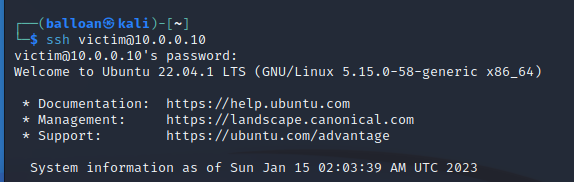
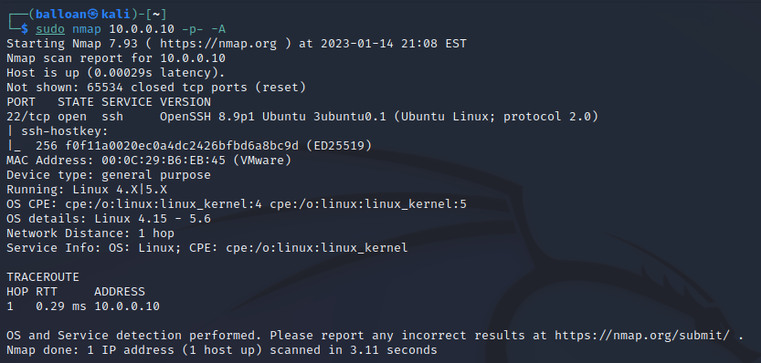
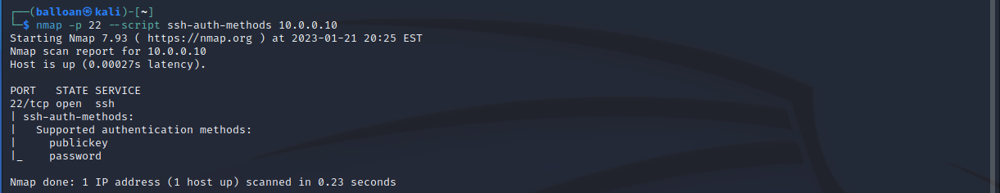

# SSH - Overview & Initial Install

I’m going to begin with a Nmap scan of the Ubuntu server, just so we can compare the changes throughout the process of installing and configuring SSH.


As expected, all ports are closed as there are currently no services running on the Ubuntu server.

Before diving into configuration, I think it’s important to consider (at a high level), what SSH is, and how it works. From there we’ll be able to consider the possible ways it can be attacked, and more importantly, defended.

SSH is a protocol that allows remote logins. Communications through SSH are encrypted. It has numerous functions - remote shell access, remote command execution, file transfer port forwarding and more. It’s extremely versatile, and is present on the vast majority of Linux distros. The most common usage, and then one I’ll be using for this example, is a client server model. The Ubuntu server will be running OpenSSH server, and any machine that connects to it is the client.

The client needs to authenticate to the server to connect - the most common methods are passwords and public key authentication. 

OpenSSH also supports a variety of other methods (ie Kerberos integration, challenge/response for PAM) but for the sake of simplicity I won’t be covering those.

Right away, it’s extremely apparent that this service is valuable to attackers. Gaining access through SSH is gaining a shell, allowing a great deal of access in the system. It’s a service that allows direct access, and it can be publicly exposed to the internet as a whole; we need to ensure it is secure.
* * *
## Installation

We'll begin by installing the SSH service.

```
sudo apt install openssh-server

systemctl status ssh
ssh.service - OpenBSD Secure Shell server
     Loaded: loaded (/lib/systemd/system/ssh.service; enabled; vendor preset: enabled)
     Active: active (running) since Sun 2023-01-15 01:54:17 UTC; 1min 19s ago
```

```
ss -tnlp

State            Recv-Q           Send-Q                     Local Address:Port                       Peer Address:Port           Process           
LISTEN           0                128                              0.0.0.0:22                              0.0.0.0:*                                
LISTEN           0                4096                       127.0.0.53%lo:53                              0.0.0.0:*                                
LISTEN           0                128                                 [::]:22                                 [::]:*                          
```

The SSH server is now running, and the server is listening on port 22.



And, as expected, we were able to connect to the server via SSH. 
* * *
## Initial Observations

The default settings of a newly installed SSH server allow us to authenticate with a password - we’ll explore why this can be a problem, as well as configuring and hardening the SSH server shortly. 

First, we’ll run a Nmap scan on the server and see what information is newly visible to us now that we have a service running.



As expected, we find that port 22 is open with the SSH service running. Nmap is able to identify the version of the SSH server, as well as a rough idea of the underlying operating system through its fingerprinting techniques.

We can also check the allowed authentication methods with Nmap.



We can also use netcat to interact with port 22 on the Ubuntu server and grab the banner.

```
nc 10.0.0.10 22
SSH-2.0-OpenSSH_8.9p1 Ubuntu-3ubuntu0.1
```

## Security Considerations

I like to start off by thinking about the attack surface. The first part is the service itself: is the service vulnerable? OpenSSH is extremely important and widely used - it is unlikely (but not impossible) that an up-to-date version of OpenSSH is going to have a glaring flaw that will be exploited. Instead, it is almost definitely going to be the configuration that will leave vulnerabilities.

If we think about the service as a whole, the most obvious attack point is the authentication process itself: how are we allowed to authenticate? What are the requirements to authenticate? What are the flaws?

For example: the server currently allows for password-based authentication. In order to connect to the server, we need to know a username and password.  From an attacker perspective, there are a few things that immediately come to mind. Do we know the username or password? Can we find it somewhere? If not, are we able to guess it? Are there limitations on how many times we can guess?

If we evaluate these questions from a defender perspective, a few hardening techniques immediately become obvious. The highest priority is the password itself - is it secure? If it’s a default password, an easily guessable password like `password123` or a short password like `cat`, it would be trivial to compromise.  In contrast, having a strong, unique (no password reuse) password immediately makes the majority of the attacking ideas previously listed much more difficult. In addition, if we are able to prevent an attacker from trying hundreds, thousands, or even millions of attempts, we can make it substantially harder to gain access. It would essentially force them to go for the low hanging fruit of credentials (ie `admin:admin`, `root:root`, `root:toor`), or to compromise the password with a different attack (leaked credentials, phishing, etc.) 

It’s always important to consider the ways that a service can be attacked or exploited. It’s also important to consider the different security options available to us. For instance, if we only allow SSH access through public key authentication, it pretty much removes all of the previous attacking ideas. Of course, it also opens up new attack avenues - if the key is not secured properly (ie accidentally leaked in a public Github repo), the server will be vulnerable.

Next up, attacking and hardening the SSH server.