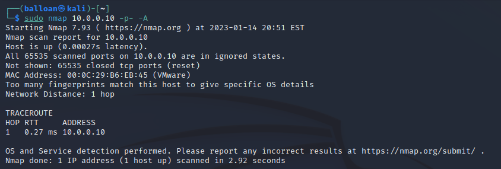

# SSH - Overview & Initial Install

I’m going to begin with a Nmap scan of the Ubuntu server, just so we can compare the changes throughout the process of installing and configuring SSH.

As expected, all ports are closed as there are currently no services running on the Ubuntu server.

Before diving into configuration, I think it’s important to consider (at a high level), what SSH is, and how it works. From there we’ll be able to consider the possible ways it can be attacked, and more importantly, defended.

SSH is a protocol that allows remote logins. Communications through SSH are encrypted. It has numerous functions - remote shell access, remote command execution, file transfer port forwarding and more. It’s extremely versatile, and is present on the vast majority of Linux distros. The most common usage, and then one I’ll be using for this example, is a client server model. The Ubuntu server will be running OpenSSH server, and any machine that connects to it is the client.

The client needs to authenticate to the server to connect - the most common methods are passwords and public key authentication. 

OpenSSH also supports a variety of other methods (ie Kerberos integration, challenge/response for PAM) but for the sake of simplicity I won’t be covering those.

Right away, it’s extremely apparent that this service is valuable to attackers. Gaining access through SSH is gaining a shell, allowing a great deal of access in the system. It’s a service that allows direct access, and it can be publicly exposed to the internet as a whole; we need to ensure it is secure.